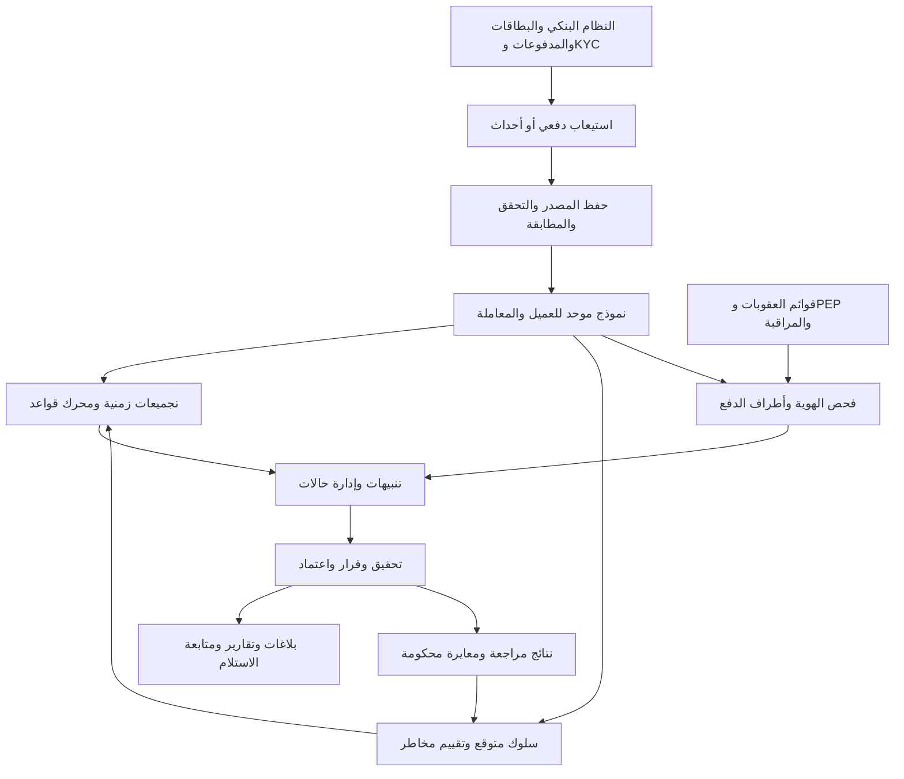

## 1. قراءة نقدية للمكوّنات المطلوبة: ما الموجود، ما الناقص مقارنة بنظام AML حديث (إدارة الحالات، KYC/CDD، فحص القوائم، الإبلاغ للوحدة الرقابية، سجل تدقيق، تقارير SAR/CTR).

### خلاصة التقييم وحدود المصادر

**المطلوب لبنك أمجاد هو منظومة امتثال تدير الرحلة من بيانات العميل والمعاملة إلى التحقيق والقرار والإبلاغ، وليس مجرد استخراج تقارير عند تجاوز عتبات.** الشاشات المطلوبة نقطة بداية مناسبة، لكنها لا تحدد هذه الرحلة ولا ضوابطها.

يعتمد هذا التحليل على النصوص الأربعة المقدمة حرفيًا. والقائمة تحتوي على **74 بندًا، منها 14 أولوية للبنك**، لكنها تعرض أسماء السيناريوهات دون مواصفاتها التنفيذية. لذلك:

- منطق الكشف أدناه **تصميم مقترح لبنك أمجاد**، وليس نقلًا لمواصفات HPAML الأصلية.
- لا يمكن استنتاج الدولة، الجهة الرقابية، العملة، الحدود القانونية أو مدد الإبلاغ من اسم البنك.
- العتبات والنوافذ المقترحة تحتاج معايرة واعتمادًا قبل الإنتاج.
- نطاق الوثيقة هو مخاطر غسل الأموال وتمويل الإرهاب؛ إدارة مخاطر الائتمان والسوق والسيولة تتطلب نطاقًا منفصلًا.

المبدأ المرجعي المناسب هو المراقبة القائمة على المخاطر وربط المعاملات بملف العميل، مع معايرة النظام وفق طبيعة البنك. وتؤكد إرشادات لجنة بازل ضرورة تغطية الحسابات والمعاملات، وتحليل السلوك، وتكييف معاملات النظام مع مخاطر المؤسسة. [إرشادات لجنة بازل](https://www.bis.org/committees/bcbs/basel-consolidated-guidelines/module/afs/10)

### تقييم الشاشات السبع

شاشة الدخول والشاشة الرئيسية تمثلان إطار الوصول والتنقل؛ أما الشاشات الوظيفية السبع فقراءتها كالتالي:

| المكوّن | ما يغطيه النص | الفجوة أو التصحيح المطلوب |
|---|---|---|
| مراقبة الحسابات الجديدة | عرض الحسابات المفتوحة حسب التاريخ | ربط الحساب بعميل موحّد، التمييز بين عميل جديد وحساب جديد لعميل قائم، التحقق من اكتمال KYC، المستفيد الحقيقي، الفحص وقرار قبول العلاقة |
| مراقبة العمليات المنفذة | عرض العمليات حسب التاريخ والفرع والسيناريو | فصل **المعاملة** عن **نتيجة القاعدة** وعن **التنبيه**؛ فقد يشمل تنبيه واحد معاملات متعددة، وقد تفعّل المعاملة عدة قواعد |
| إدارة السيناريوهات | إضافة وتعديل وحذف | إصدارات، اختبار تاريخي، اعتماد مستقل، تاريخ نفاذ، تراجع إلى إصدار سابق، وتقاعد السيناريو بدل حذف تاريخه |
| إدارة تصنيف المخاطر | تصنيف الأنشطة والعمليات والمنتجات | بناء تقييم للعميل يجمع هويته وملكيته وجغرافيته ومنتجاته وسلوكه، مع أسباب الدرجة وتاريخ تغيرها |
| البحث في القوائم السوداء | بحث يدوي بالاسم | فحص آلي عند إنشاء العلاقة وتحديث البيانات والقوائم، وفحص أطراف المدفوعات حيث يلزم؛ فصل العقوبات عن PEP وعن قوائم المراقبة الداخلية |
| إدارة المستخدمين | إضافة وتعديل وحذف ونقل | صلاحيات حسب الدور ونطاق البيانات، فصل الإعداد عن الاعتماد، تعطيل الحساب بدل محو هويته التاريخية، مراجعة الصلاحيات |
| التقارير | تقارير مرتبطة بالسيناريوهات | تقارير تشغيلية ورقابية منفصلة، حزم أدلة، دورة اعتماد وإرسال، متابعة القبول والرفض والتصحيح |

**ملاحظات على الحقول والإجراءات:**

- «تاريخ تنفيذ الحساب» في شاشة العمليات يحتاج تصحيحًا إلى **تاريخ ووقت تنفيذ العملية**.
- «كود العملية» في شاشة الحسابات الجديدة ملتبس: هل هو رقم طلب فتح الحساب أم نوع عملية؟ يلزم تعريف مستقل.
- رقم الحساب لا يغني عن رقم العميل الموحّد.
- «الإجراء» و«إرسال المعالجة» لا يحددان سير عمل: من يرسل؟ إلى من؟ ما الحالات؟ ومن يملك الإغلاق أو التصعيد؟

### المكوّنات الناقصة في دورة الامتثال

| المكوّن | المواصفة المطلوبة |
|---|---|
| إدارة التنبيهات والحالات | استقبال، توزيع، أولوية، تحقيق، طلب معلومات، مراجعة، تصعيد، إغلاق مسبب، إعادة فتح، ومواعيد إنجاز |
| KYC/CDD | التحقق من الهوية، غرض العلاقة، النشاط المتوقع، مصدر الأموال، هيكل الملكية والمستفيد الحقيقي، تحديثات دورية وحدثية |
| العناية الواجبة المعززة EDD | جمع أدلة إضافية للحالات التي تستدعيها السياسة، توثيق مصادر الأموال والثروة عند انطباقها، واعتمادات مختصة |
| إدارة القوائم والفحص | مصدر القائمة وإصدارها وتاريخ تحديثها، أسماء بديلة، نتائج المطابقة، قرار المحلل، إعادة الفحص، ومراقبة تعطل التحديث |
| الإبلاغ للوحدة المختصة | إعداد البلاغ، استكمال البيانات، اعتماد، إرسال بالقناة المعتمدة، إيصال استلام، معالجة رفض أو طلب استكمال |
| سجل التدقيق | توثيق المشاهدة والتعديل والتصدير والقرارات وتغييرات القواعد والصلاحيات، مع حماية السجل من العبث |
| جودة البيانات | مطابقة أعداد ومبالغ المصدر، كشف النقص والتكرار والتأخر، وعزل السجلات غير الصالحة مع مسؤول واضح لمعالجتها |
| حوكمة القواعد والنماذج | مالك لكل قاعدة، سبب استخدامها، اختبارات، حدود معروفة، سجل اعتماد، وقياس الفعالية |
| إدارة الوثائق والأدلة | حفظ المستندات ونسخها ومصدرها وبصماتها وربطها بالعميل والحالة والبلاغ |
| الاستمرارية والتشغيل | نسخ احتياطي، استعادة، مراقبة التأخر، إعادة تشغيل آمنة، وتعامل موثق مع انقطاع المصادر |

تحدد توصيات FATF إطارًا للعناية الواجبة وحفظ السجلات والإبلاغ عن الاشتباه وسرية البلاغات. وهي معايير دولية تُترجم إلى التزامات محلية؛ لذلك يجب إعداد مصفوفة تربط كل التزام بالنص النافذ على البنك. [توصيات FATF](https://www.fatf-gafi.org/en/publications/Fatfrecommendations/Fatf-recommendations.html)

### فصل التنبيه عن البلاغ وعن إجراء الدفع

يجب أن تكون هذه مخرجات مستقلة:

1. **مؤشر:** حقيقة تستحق الانتباه، مثل حداثة العلاقة أو وجود صفة PEP.
2. **تنبيه:** تحقق شرط كشف يستدعي المراجعة.
3. **حالة تحقيق:** ملف يجمع التنبيهات والأطراف والمعاملات والأدلة.
4. **بلاغ SAR/STR:** إبلاغ عن نشاط أو معاملة مشتبه بها، وفق تعريف الجهة المختصة وقرار الامتثال.
5. **تقرير CTR:** تقرير عن معاملات نقدية وفق شروط محلية محددة، إن كان مطلوبًا؛ لا يثبت الاشتباه بذاته.
6. **قرار تنفيذ دفع:** سماح أو تعليق أو رفض أو إجراء آخر، بحسب صلاحيات البنك والمتطلبات المنطبقة.

لا يحل تقرير السيناريو محل SAR/STR أو CTR. كما أن الاشتباه لا يتوقف على تجاوز مبلغ؛ وتتناول توصية FATF 20 وتفسيرها المعاملات المشتبه بها، بما فيها المحاولات، بصرف النظر عن المبلغ. [توصيات FATF، التوصية 20 وتفسيرها](https://www.fatf-gafi.org/content/dam/fatf-gafi/recommendations/fatf-recommendations-2012.pdf)

### قراءة نقدية للقائمة الكاملة

- **HPAML00000** قناة لإنشاء تنبيه يدوي، وليس قاعدة كشف آلية.
- **HPAML10032 وHPAML10033** أقرب إلى مؤشرات وعمليات عناية واجبة من كونهما دليل اشتباه.
- سيناريوهات التأمين والأقساط وإنهاء الوثائق لا تُنفذ قبل تأكيد أن البنك يقدم المنتجات المعنية أو يراقبها.
- النسخ المرتبطة بتصنيف المخاطر، مثل **10206 و10220**، يمكن مشاركتها في محرك واحد مع السيناريو الأساسي، مع الحفاظ على أكوادها ومتطلباتها المعتمدة.
- اختلاف البادئة **HHPAML/HPAML** يحتاج قاموس تحويل يحفظ النص الأصلي ويمنع إنشاء سيناريوهات مكررة.
- اختيار 14 أولوية لا يكفي لإعلان اكتمال AML/CFT؛ مثلًا فحص الأطراف الخارجية والعقوبات يحتاج معالجة مستقلة رغم أن معظم أكواده خارج الأولويات.
- سيناريوهات المبالغ الكبيرة وحدها لا توفر تغطية كافية لتمويل الإرهاب؛ يجب تقييم الأنماط الصغيرة المتكررة والروابط والأطراف والجغرافيا.

## 2. السيناريوهات الـ14 ذات الأولوية: لكل سيناريو — الهدف الرقابي، منطق الكشف بدقة (نوافذ زمنية، عتبات، تجميع)، البيانات المطلوبة من النظام البنكي الأساسي، المعاملات (parameters) القابلة للضبط، ومخرج التنبيه. اكتبها بجدول أو قالب موحّد.

### قواعد مشتركة لجميع السيناريوهات

**وحدة المراقبة الافتراضية:** العميل الموحّد عبر حساباته وفروعه، مع الاحتفاظ بتفصيل الحساب. السيناريوهات المرتبطة بالخمول تعمل أساسًا على الحساب.

**تعريف المعاملة المؤهلة:**

- معاملة اقتصادية فريدة، وليست كل قيد محاسبي ناتج عنها.
- تُحسب المعاملات المنفذة والمؤكدة في قواعد المبالغ؛ وتُحفظ المحاولات والرفض لمساراتها المناسبة.
- تُربط الإلغاءات والتصحيحات بالمعاملة الأصلية، وتُعاد الحسابات المتأثرة دون محو الدليل السابق.
- عند التجميع للعميل، تُفصل التحويلات بين حساباته عن الأموال القادمة من خارج ملكيته؛ وتظل تلك التحويلات محفوظة للتحليل.
- لا تُجمع حسابات أشخاص مختلفين لمجرد تشابه الاسم أو الهاتف؛ تجميع الأطراف المرتبطة يحتاج علاقة مثبتة وسياسة معتمدة.

**الوقت والعملات:**

- النافذة المتحركة `W` تعني العمليات في الفترة `(t−W، t]` بحسب وقت الحدث.
- يُحفظ وقت الحدث ووقت القيد ووقت الوصول، وتُحدد المنطقة الزمنية ليوم العمل.
- يُحفظ المبلغ والعملة الأصليان، ومقابلهما بعملة مرجعية وسعر الصرف ومصدره وتوقيته.
- الحدود القانونية، إن وجدت، تُحسب بقاعدة التحويل والتجميع القانونية الخاصة بها.

**البيانات المشتركة B:**

`transaction_id`، النظام المصدر، رقم العميل والحساب، نوع العملية واتجاهها وحالتها، المبلغ والعملة، الأوقات، القناة، الفرع المنفذ، الطرف المقابل، مرجع الإلغاء، المنتج، ونسخة تصنيف المخاطر ذات الصلة.

**طريقة اقتراح العتبات المالية:**

يرمز `Q99` مثلًا إلى القيمة التي لا تتجاوزها 99% من مشاهدات **المقياس نفسه** ضمن شريحة متجانسة. فعتبة إجمالي أسبوعي تُستخرج من إجماليات أسبوعية، لا من مبالغ عمليات منفردة.

نقترح تاريخًا أوليًا من **6–12 شهرًا** عند توافره، مع مراجعة الموسمية وجودة البيانات وكفاية العينة. تُثبت العتبات المعتمدة بإصدار؛ ولا ترتفع تلقائيًا لمجرد ارتفاع النشاط الأخير. عند غياب تاريخ كافٍ، يعتمد البنك عتبة تجريبية من بيانات شريحة مناسبة أو خبرة موثقة، ولا يُستعاض عنها بالصفر.

**كل القيم التالية بداية للاختبار والمعايرة، وليست حدودًا تشريعية أو مواصفات HPAML الأصلية.**

### HPAML10001 — استخدام أجهزة الصراف الآلي في مناطق متعددة

- **الهدف الرقابي:** كشف الانتشار الجغرافي غير المعتاد لسحوبات العميل خلال فترة قصيرة.
- **منطق الكشف:** جمع سحوبات ATM الناجحة للعميل في `W`. يتحقق الشرط عندما `عدد المناطق الإدارية المميزة ≥ K`. تعتمد المنطقة على الموقع الفعلي للجهاز، لا فرع الحساب أو موقع مركز معالجة البطاقة. يشمل التجميع بطاقات العميل وحساباته المرتبطة، مع عرض كل بطاقة منفردة.
- **البيانات المطلوبة:** B، رمز بطاقة مستعار، معرف الجهاز، الدولة والمنطقة والمدينة، وقت السحب الدقيق، وبيانات موقع الجهاز من شبكة البطاقات؛ وقد لا تتوافر هذه التفاصيل في النظام الأساسي وحده.
- **المعاملات المقترحة:** `W=24 ساعة` و`K=2` كبداية حساسة للمراجعة. يضبط مستوى التقسيم الإداري، ونطاق الأجهزة المحلية والخارجية. يمكن استخدام سرعة الانتقال والمبلغ لرفع الأولوية بعد التحقق من دقة المواقع.
- **مخرج التنبيه:** تسلسل زمني ومواقع السحب، عدد المناطق، إجمالي السحوبات، البطاقات المشاركة، ومقارنة بالنمط السابق.

**تعارض المصدر:** «سحوبات صراف آلي كبيرة» ليست مرادفًا لتعدد المناطق. إن أراد البنك كشف السحب الكبير، يُضاف شرط مستقل واضح أو قاعدة منفصلة؛ لا يُغيّر معنى هذا الكود ضمنيًا.

### HPAML10005 — إيداعات نقدية كبيرة

- **الهدف الرقابي:** مراجعة إيداع نقدي منفرد كبير بالنسبة إلى شريحة العميل.
- **منطق الكشف:** لكل إيداع مصنف نقديًا ومؤكد، ينشأ تنبيه إذا `المبلغ المرجعي ≥ T_single`. لا تدخل الحوالات والشيكات تلقائيًا تحت «نقدي».
- **البيانات المطلوبة:** B، تصنيف الأداة، هوية المودع الفعلي إن اختلف عن صاحب الحساب، مصدر الأموال المصرح به، وشريحة العميل.
- **المعاملات المقترحة:** `T_single=Q99.5` لمبالغ الإيداع النقدي المنفرد ضمن الشريحة، كبداية تركز على الطرف الأعلى من التوزيع. يضبط البنك العتبة حسب الأفراد والأعمال والمنتجات، وتاريخ نفاذها.
- **مخرج التنبيه:** المعاملة، المودع، المبلغ الأصلي والمرجعي، العتبة، نسبة تجاوزها، وسجل الإيداعات والسلوك المتوقع.

العنوان العربي «إيداعات مالية» أوسع من العنوان الإنجليزي؛ المقترح هنا يلتزم بالنقد، ويحتاج توسيعه إلى أدوات أخرى اعتمادًا صريحًا.

### HPAML10006 — إجمالي معاملات نقدية كبير خلال فترة

- **الهدف الرقابي:** كشف حجم حركة نقدية مرتفع يتكون من عمليات متعددة.
- **منطق الكشف:** يحسب للعميل داخل `W`: إجمالي الإيداعات النقدية `D`، وإجمالي السحوبات النقدية `O`، والحركة النقدية الإجمالية `G=D+O`. التفسير الموافق للعنوان الإنجليزي ينبه إذا `G≥T_gross`. أما التعليق العربي فيتطلب نسخة تعتمد `D≥T_deposit`. لا يستخدم صافي `D−O` لأنه يخفي حجم التداول.
- **البيانات المطلوبة:** B، التمييز الموثوق للنقد، اتجاه التدفق، وربط كل الحسابات بالعميل.
- **المعاملات المقترحة:** نافذتان مستقلتان: `يوم عمل` و`7 أيام متحركة`. تبدأ كل عتبة من `Q99` لإجماليات النافذة والشريحة المقابلة. معامل `scope` يحدد: إيداعات فقط، أو حركة نقدية إجمالية.
- **مخرج التنبيه:** الإجماليات الثلاثة، العدد، الفروع والحسابات، أكبر العمليات، والمنطق الذي تحقق.

يجب اعتماد التفسير قبل التطوير؛ ويمكن دعم الاثنين كنسختين مسمّاتين بوضوح، مع ربط النتائج المتداخلة.

### HPAML10007 — إيداعات نقدية مجزأة

- **الهدف الرقابي:** كشف تجميع مبلغ عبر إيداعات منفردة دون حد مرجعي.
- **منطق الكشف:** يعرّف `L` كحد مرجعي معلوم المصدر. تُجمع الإيداعات النقدية للعميل عبر الفروع والقنوات في `W`. في النسخة الأولية، تؤخذ العمليات التي تحقق `αL≤المبلغ<L`، ثم ينشأ تنبيه إذا `العدد≥N` و`مجموعها≥S`. تُفحص العملات المختلفة بعد التحويل المعتمد.
- **البيانات المطلوبة:** B، المودع الفعلي، النقد/غير النقد، الفرع والجهاز، وحد `L` وإصداره وعملته.
- **المعاملات المقترحة:** `W=7 أيام`، `N=3`، `α=0.5`، و`S=2L`. قرب العمليات من `0.8L` فأعلى يمكن أن يرفع الأولوية. يكون `L` حدًا قانونيًا مثبتًا إن انطبق، أو حد رقابة داخليًا معتمدًا، مثل عتبة الإيداع الكبير.
- **مخرج التنبيه:** مجموعة الإيداعات، نسبتها إلى `L`، مجموعها، الفواصل الزمنية، وتوزيع المودعين والفروع.

هذه النسخة لا تغطي كامل التجزئة؛ لذلك تُختبر نسخة مكملة للمبالغ الأقل من `0.5L` على نافذة أطول، حتى لا تصبح منطقة غير مراقبة. ولا يثبت النمط وحده تعمد التحايل.

### HPAML10008 — نشاط على حساب غير نشط

- **الهدف الرقابي:** كشف عودة النشاط بعد انقطاع طويل أو أثناء حالة عدم نشاط مسجلة.
- **منطق الكشف:** عند وصول أول معاملة مؤهلة للحساب، تُقرأ حالته **قبل العملية** ووقت آخر حركة فعلية بمبادرة العميل. ينشأ تنبيه إذا كانت الحالة السابقة ضمن الحالات غير النشطة المعتمدة، أو كان الفاصل منذ آخر نشاط مؤهل `≥D`. تستبعد الفوائد والرسوم والقيود النظامية من احتساب كسر الخمول.
- **البيانات المطلوبة:** B، تاريخ حالة الحساب، تاريخ الفتح، آخر نشاط مؤهل، نوع منشئ الحركة، وسجل إعادة التنشيط.
- **المعاملات المقترحة:** `D=180 يومًا` كفرضية رقابية داخلية، مع اختبار بدائل أقصر وأطول. تعريف «الحساب الخامل» القانوني أو التشغيلي يُحفظ منفصلًا. إن لم يسبق للحساب نشاط، يستخدم تاريخ الفتح فقط ضمن فرع منطقي معتمد.
- **مخرج التنبيه:** مدة الانقطاع، الحالة السابقة، أول معاملة، مصدرها، بيانات إعادة التنشيط، وأي تغير حديث في هوية العميل أو وسائل الاتصال.

لا يشترط مبلغ كبير لالتقاط العودة إلى النشاط؛ يؤثر المبلغ في أولوية المراجعة.

### HPAML10009 — معاملات متشابهة القيمة

- **الهدف الرقابي:** كشف تكرار مبالغ متقاربة قد يشير إلى نمط منظم.
- **منطق الكشف:** تُقسم معاملات العميل بحسب النوع والاتجاه والعملة الأصلية داخل `W`. تُرتب المبالغ الموجبة، وتُبحث مجموعات تحقق `(أكبر مبلغ−أصغر مبلغ)/أصغر مبلغ≤ε`. ينشأ تنبيه إذا `عدد المجموعة≥N` و`مجموعها≥S_min`. لا تكفي مقارنة كل مبلغ بجاره، لأنها قد تربط سلسلة واسعة غير متشابهة فعليًا.
- **البيانات المطلوبة:** B، الغرض، الطرف المقابل، مراجع الرواتب والأقساط والدفع الدوري، ونوع المعاملة.
- **المعاملات المقترحة:** `W=7 أيام`، `N=4`، و`ε=1%` كبداية. يحدد `S_min` من توزيع مجموعات مماثلة تاريخيًا، مثل `Q95` بعد مراجعتها. تُختبر معاملات منفصلة للرواتب والأقساط.
- **مخرج التنبيه:** المجموعة، المدى النسبي، العدد والمجموع، الأطراف والأغراض، ومدى التوافق مع التزامات دورية موثقة.

تشابه القيمة يختلف عن كون المبلغ مستديرًا؛ لا يُدمج هذا السيناريو مع **10025** دون تعريف مستقل.

### HPAML10014 — سحوبات مجزأة

- **الهدف الرقابي:** كشف سحب مبلغ إجمالي عبر عمليات أصغر من حد مرجعي.
- **منطق الكشف:** النسخة الأولى المقترحة تشمل السحوبات النقدية من الفروع وATM. تُجمع للعميل في `W` العمليات التي تحقق `αL_out≤المبلغ<L_out`. يتحقق التنبيه إذا `العدد≥N` و`المجموع≥S`. التحويلات الصادرة لا تُعامل كسحب نقدي.
- **البيانات المطلوبة:** B، القناة، الجهاز أو الفرع، هوية الساحب المفوض إن وجدت، وحدود السحب التشغيلية لكل قناة.
- **المعاملات المقترحة:** `W=7 أيام`، `N=3`، `α=0.5`، و`S=2L_out`. يحدد `L_out` مستقلًا عن حد الإيداع. يجب معايرته مع حدود الأجهزة اليومية وحد العملية، لأن تكرار السحب قد تفرضه تلك الحدود.
- **مخرج التنبيه:** سلسلة السحوبات، المجموع، القنوات والمواقع، مدى اقترابها من الحد، والأموال الداخلة التي سبقتها.

يحتاج البنك إلى حسم شمول الأدوات غير النقدية في معنى “Withdrawals”، مع اختبار تغطية مكملة للتجزئة الأصغر.

### HPAML10017 — إيداعات تتجاوز الدخل

- **الهدف الرقابي:** كشف عدم اتساق الأموال الداخلة مع الدخل أو النشاط الموثق.
- **منطق الكشف:** في نهاية كل شهر تقويمي، يحسب `D_m` للأموال الداخلة المؤهلة من خارج ملكية العميل، بعد استبعاد الإلغاءات والتحويلات الذاتية المثبتة وفصل التمويل المصرفي المعروف. يقارن مع الدخل الشهري الموثق للفرد `I_m`: التنبيه إذا `D_m>k×I_m` و`D_m−I_m≥Δ_min`. للشركات يستخدم التدفق/المبيعات المتوقعة المناسبة لطبيعة النشاط، لا دخل المالك الشخصي.
- **البيانات المطلوبة:** B، الدخل ومصدره ودوريته وعملته وتاريخ التحقق، النشاط المتوقع، مبيعات الأعمال، التحويلات الذاتية، وعقود التمويل أو مصادر الأموال الاستثنائية.
- **المعاملات المقترحة:** `k=3` بداية لاختبار الانحراف الكبير. يحدد `Δ_min` حسب الشريحة، ويمكن بدء معايرته من `Q95` للفروق الشهرية في بيانات مرجعية مراجعة. تضبط أنواع الإيداع الداخلة في المقارنة.
- **مخرج التنبيه:** إجمالي الداخل، قيمة الدخل ومصدرها وحداثتها، النسبة والفرق، والاستبعادات المبررة.

الدخل المفقود أو الصفري أو القديم يفتح مهمة استكمال CDD؛ لا يُحوّل حسابيًا إلى اشتباه مؤكد أو قسمة على صفر.

### HPAML10020 — حوالات واردة كبيرة

- **الهدف الرقابي:** مراجعة حوالة واردة منفردة كبيرة وسياق مصدرها.
- **منطق الكشف:** تنبيه لكل حوالة واردة مؤهلة إذا `المبلغ المرجعي≥T_wire`. تُوحد رسالة الدفع والتسوية وقيد الحساب تحت معاملة واحدة، حتى لا يُحسب المبلغ عدة مرات.
- **البيانات المطلوبة:** B، معرف الحوالة، المرسل والمستفيد وحساباتهما، البنوك والدول، الغرض، الرسوم، حالة التسوية، ومعرف تتبع مثل UETR عند توافره.
- **المعاملات المقترحة:** `T_wire=Q99.5` لمبالغ الحوالات الواردة في الشريحة. يضبط شمول المحلية والخارجية، والمنتجات، والمبلغ الإجمالي أو المقيد صافيًا، مع حفظ الاثنين.
- **مخرج التنبيه:** سلسلة أطراف الدفع، مبلغ الحوالة والعتبة، الغرض، تاريخ العلاقة مع المرسل، ونتائج فحص الأطراف.

تجميع عدة حوالات في فترة يمثل قاعدة أخرى أو امتدادًا مصرحًا؛ لا يضاف ضمنيًا إلى تعريف «حوالة كبيرة».

### HPAML10028 — استخدام عدة فروع

- **الهدف الرقابي:** كشف انتشار التعامل بين فروع مختلفة بصورة تستحق التفسير.
- **منطق الكشف:** تُجمع معاملات العميل الحضورية المؤهلة في `W`. يتحقق الشرط عند `عدد الفروع المنفذة المميزة≥K`. تستخدم هوية الفرع الذي نفذ الخدمة فعليًا، لا فرع ملكية الحساب أو المركز المحاسبي.
- **البيانات المطلوبة:** B، الفرع المنفذ، القناة، خريطة الفروع، مواقع نشاط العميل، واتفاقيات التحصيل أو الخدمة متعددة الفروع.
- **المعاملات المقترحة:** `W=7 أيام` و`K=3`، لإبراز الانتشار المتكرر بدل زيارة عارضة لفرعين. لا يلزم حد مالي أولي؛ يرفع المبلغ غير المعتاد ونوع الحركة أولوية التنبيه.
- **مخرج التنبيه:** الفروع والتواريخ، العدد والمبالغ حسب الفرع، المقارنة بالنمط السابق، ووجود نشاط تجاري يفسر التوزيع.

الاستثناءات، مثل التحصيل التجاري المعتاد، تكون محددة النطاق والمدة ومعتمدة، مع استمرار مراجعتها.

### HPAML10031 — نشاط حوالات خارجية

- **الهدف الرقابي:** مراقبة التعرض للحوالات عبر الحدود ومدى اتساقه مع ملف العميل.
- **منطق الكشف:** تُصنف الحوالة عبر الحدود وفق مسار الدفع الفعلي وبلدي المؤسستين المرسلة والمستقبلة؛ اختلاف العملة وحده لا يكفي. تجمع الواردة والصادرة منفصلتين في `W`. ينشأ تنبيه إذا تحقق أحد الآتي: `الإجمالي≥T_foreign`، أو `العدد≥N_foreign`، أو ظهور دولة مصنفة عالية المخاطر في دور محدد بالسياسة.
- **البيانات المطلوبة:** B، أطراف وبنوك الدفع ودولها وأدوارها، الغرض، الدول المتوقعة ضمن CDD، وتصنيف مخاطر الدول بإصداراته.
- **المعاملات المقترحة:** `W=30 يومًا`، `N_foreign=3` و`T_foreign=Q95` لإجماليات الشريحة كبداية تجريبية. تحتاج شرائح الاستيراد والتصدير عتبات مختلفة. يحدد دور الدولة الذي يفعّل الشرط: المرسل، المستفيد أو وسيط الدفع.
- **مخرج التنبيه:** توزيع الحوالات حسب الاتجاه والدولة والطرف، سبب تحقق الشرط، ومدى اتساقه مع غرض العلاقة.

الحوالة الخارجية ليست اشتباهًا بذاتها، وتصنيف الدولة عالي المخاطر ليس تلقائيًا حظرًا عليها.

### HPAML10032 — عميل جديد

- **الهدف الرقابي:** ضمان اكتمال قبول العلاقة ومراقبة سلوكها الأولي.
- **منطق الكشف:** يعرّف العميل الجديد بأن عمر أول علاقة موثقة مع البنك `≤A`. عند تأسيس العلاقة تُنشأ مهمة قبول واحدة. يُفتح استثناء إذا لم يكتمل عنصر إلزامي عند موعد وجوبه، أو ظهر نشاط يخالف الاستخدام المتوقع خلال فترة الحداثة. فتح حساب إضافي لعميل قديم لا يعيد عمر العميل إلى الصفر.
- **البيانات المطلوبة:** معرف العميل الموحّد، أول تاريخ علاقة، الحسابات السابقة، سجل دمج العملاء وترحيل البيانات، KYC، نتائج الفحص، الغرض والنشاط المتوقع.
- **المعاملات المقترحة:** `A=30 يومًا` كبداية، مع إمكانية تمديد المتابعة لفئات مختارة إلى `90 يومًا`. مواعيد اكتمال المتطلبات تضبط وفق السياسة والالتزام المحلي؛ لا تُمنح مهلة تلقائية لما يلزم استكماله قبل الفتح.
- **مخرج التنبيه:** مهمة قبول أو استكمال، قائمة النواقص، المسؤول والموعد، وأي انحراف سلوكي.

وسم «جديد» مؤشر سياقي؛ لا ينتج وحده بلاغ اشتباه أو تنبيه معاملات يوميًا.

### HPAML10033 — مؤشر الشخص المعرّض سياسيًا PEP

- **الهدف الرقابي:** تحديد الصفة السياسية والعلاقات ذات الصلة وتطبيق المراجعة المناسبة.
- **منطق الكشف:** عند إنشاء العميل أو تحديث بياناته أو القائمة، يُفحص العميل والمستفيد الحقيقي والأشخاص المرتبطون بحسب السياسة. التطابق المحتمل يفتح مهمة تحقق هوية. تأكيد الصفة أو تغيرها يفتح مراجعة CDD/EDD واعتماداتها. وجود صفة مؤكدة مع مراجعة مستحقة غير منجزة ينتج استثناءً تشغيليًا.
- **البيانات المطلوبة:** الأسماء والهويات والميلاد والجنسية، الصفة والمنصب والدولة، تاريخ بدء الصفة وانتهائها، نوع PEP، العلاقات العائلية أو الوثيقة، مصدر المعلومة، وبيانات الأموال والثروة عند لزومها.
- **المعاملات المقترحة:** تحديث حدثي مع إعادة فحص يومية للبيانات المتغيرة كخط أساس تشغيلي. مراجعة كل `6 أشهر` مقترح أولي للفئات التي يقرر البنك أنها عالية المخاطر، مع إعادة فتح عند تغير جوهري. مدة التعامل مع الصفة بعد انتهاء المنصب تُحدد بالسياسة المبنية على المخاطر.
- **مخرج التنبيه:** بطاقة الصفة وأدلتها، نتيجة التحقق، نوع العلاقة، المتطلبات الناقصة والاعتمادات المستحقة.

التسمية الأدق هي «شخص معرّض سياسيًا». تؤكد FATF أن إجراءات PEP وقائية، ولا تعني أن جميع الأشخاص المشمولين متورطون في جرائم. [إرشادات FATF بشأن PEP](https://www.fatf-gafi.org/en/publications/Fatfrecommendations/Peps-r12-r22.html)

### HPAML10040 — إيداعات عالية المخاطر

- **الهدف الرقابي:** وفق تعليق البنك، مراجعة إيداعات العملاء المصنفين مرتفعي المخاطر.
- **منطق الكشف:** يحدد تصنيف العميل النافذ قبل المعاملة أو بداية التقييم. إذا كان مرتفع المخاطر، ينشأ تنبيه عندما `إيداع منفرد≥T_H_single` أو `مجموع الإيداعات المؤهلة في W≥T_H_total`. يعرّف نطاق الأدوات صراحة؛ العنوان لا يحصر الإيداع في النقد.
- **البيانات المطلوبة:** B، تاريخ تصنيف العميل وأسبابه، أداة الإيداع، المودع والطرف المقابل، مصدر الأموال والنشاط المتوقع.
- **المعاملات المقترحة:** `W=7 أيام`. بداية اختبار ممكنة هي عتبات `Q95` لمبالغ وإجماليات الشريحة الاقتصادية المقارنة، لإتاحة حساسية أعلى من قاعدة الإيداع الكبير العامة. يضبط البنك النسب والحدود حسب النتائج.
- **مخرج التنبيه:** الإيداعات، التصنيف النافذ وأسبابه، تجاوز العتبة، مصدر الأموال، وارتباط النتيجة بتنبيهات 10005 و10006.

العنوان الإنجليزي قد يشير إلى **مخاطر الإيداع نفسه**، بينما تعليق البنك يشير إلى **مخاطر صاحبه**. يحتاج هذا التفسير اعتمادًا. ويجب منع حلقة ترفع فيها نتيجة القاعدة المخاطر ثم تعيد تشغيل نفسها على البيانات ذاتها بلا معلومة جديدة.

### مواصفة موحّدة لمخرج التنبيه

كل تنبيه يجب أن يحفظ:

- العميل والحسابات والمعاملات المرتبطة، ووقت الاكتشاف.
- كود السيناريو وإصداره ونسخة المعاملات المستخدمة.
- بداية النافذة ونهايتها ومستوى التجميع.
- القيم المحسوبة والعتبات وشرح تحقق الشرط.
- نسخ بيانات المخاطر والقوائم وأسعار الصرف اللازمة لإعادة الإنتاج.
- حالة اكتمال البيانات والتنبيه الأولي أو المعاد احتسابه.
- الأولوية وأسبابها والمسؤول والحالة التشغيلية.
- روابط النتائج المتداخلة، دون إسقاط دليل أي قاعدة.

تُجمع نتائج القواعد المرتبطة في حالة مناسبة، مع تحديث التنبيه عند وصول أدلة جديدة ومنع إعادة إنشائه بسبب إعادة إرسال البيانات فقط.

## 3. بنية النظام بأحدث التقنيات: طبقات الاستيعاب (batch/streaming)، محرّك القواعد، نمذجة سلوك العميل (baseline/peer group)، تقييم مخاطر العميل الديناميكي، فحص القوائم بالمطابقة الضبابية للأسماء العربية/اللاتينية، إدارة الحالات، التقارير، الأمن والامتثال، مع اقتراح تقنيات محددة وبدائل.

### البنية المقترحة

**التوصية:** البدء بتطبيق معياري ذي وحدات واضحة، وقاعدة تشغيل مركزية، ومعالجة مستقلة للبيانات. يُضاف التعقيد الموزع عندما تثبت الحاجة بالحجم وزمن الاستجابة، مع استخدام إصدارات مستقرة ومدعومة والتحقق من توافقها عند التنفيذ.

مسار فحص الدفع **قبل التنفيذ**، عند الحاجة، يتكامل مباشرة مع منصة المدفوعات. أما الرسم فيعرض تدفق المراقبة والتحقيق؛ لا ينبغي انتظار المعالجة الليلية لاتخاذ إجراء يلزم قبل الدفع.

### الاستيعاب الدفعي واللحظي

| الطبقة | الاقتراح | البديل أو معيار الاختيار |
|---|---|---|
| المعالجة الدفعية | Spring Batch مع ملفات مؤمنة أو واجهات أو نسخة قراءة من المصدر | أداة ETL المعتمدة في البنك؛ يناسب البداية إذا سمحت متطلبات المراقبة بالتأخير |
| التقاط التغييرات CDC | Debezium مع Kafka عند دعم قاعدة المصدر والمورد | واجهات أحداث أو استخراج تزايدي معتمد إذا تعذر الوصول إلى سجل التغييرات |
| التجميع اللحظي | Apache Flink للنوافذ والحالة والبيانات المتأخرة | تجميعات SQL مجدولة للأحجام الأقل، مع اختبار تكافؤ النتائج |
| التخزين التشغيلي | PostgreSQL للعميل والتنبيه والحالة والقرارات | قاعدة المؤسسة الحالية إذا حققت المتطلبات والدعم |
| البيانات الخام والأدلة | تخزين كائنات مؤسسي يدعم سياسات الاحتفاظ والحماية | مستودع الوثائق المؤسسي مع حفظ النسخ والبصمات |

يدعم Spring Batch تنظيم المعالجة الدفعية، وتوضح وثائق Debezium خيارات التقاط تغييرات قواعد البيانات ونقلها إلى بنى الرسائل. ويقدم Flink مفهوم **وقت الحدث** وعلامات تقدم الزمن لمعالجة الأحداث غير المرتبة والمتأخرة. [Spring Batch](https://docs.spring.io/spring-batch/reference/)، [Debezium](https://debezium.io/documentation/reference/stable/architecture.html)، [Flink](https://nightlies.apache.org/flink/flink-docs-stable/docs/concepts/time/)

**ضوابط إلزامية في تصميم الاستيعاب:**

- عقد بيانات لكل مصدر يحدد الحقول والتصنيفات والتوقيت والمالك.
- مطابقة الأعداد والمبالغ حسب اليوم والعملة والنوع؛ وفصل النتيجة الكاملة عن النتيجة الناقصة.
- منع التكرار بمفتاح المصدر والمعاملة والإصدار، وربط قيود العملية الاقتصادية الواحدة.
- عدم الاعتماد على `updated_at` وحده إذا كان المصدر لا يضمن التقاط كل تغيير.
- نافذة تأخر تقاس من المصدر؛ تصل البيانات المتأخرة إلى إعادة احتساب موثقة.
- إعادة التشغيل لا تكرر التنبيهات أو البلاغات.
- تعطل المصدر يطلق إنذار تشغيل؛ لا يظهر على أنه «لا توجد معاملات مشبوهة».

### محرك القواعد

يفصل التصميم بين:

1. **حساب المؤشرات:** مجموع النقد خلال أسبوع، عدد الفروع، مدة الخمول.
2. **تقييم الشروط:** مقارنة المؤشر بالمعاملات المعتمدة.
3. **إدارة النتائج:** إنشاء التنبيه أو تحديثه وربطه بحالة.

الاقتراح الأولي: خدمات Java/Spring مع قواعد معرفة بصيغة مقيدة ومتحقق منها، وتجميعات SQL أو Flink. يمكن استخدام جداول قرار وفق **DMN** عندما يحتاج محللو الأعمال إلى قواعد قابلة للمراجعة بصريًا؛ وهو معيار لنمذجة القرارات. [مواصفة OMG DMN](https://www.omg.org/spec/DMN/)

لا يُسمح لمستخدم الشاشة بإدخال شيفرة أو SQL غير مقيد. وتكون دورة القاعدة:

`مسودة ← اختبار تاريخي ← مراجعة مستقلة ← اعتماد ← تشغيل موازٍ ← تفعيل ← مراجعة دورية/تقاعد`

يُحفظ مع كل إصدار تعريف النطاق، مصدر المتطلبات، المعاملات، نتائج الاختبار، صاحب الاعتماد وتاريخ النفاذ.

### نمذجة سلوك العميل ومجموعات المقارنة

تستخدم ثلاثة مراجع متكاملة:

- **المتوقع المصرح به:** النشاط والدخل والدول والمنتجات الموثقة في CDD.
- **السلوك التاريخي للعميل:** النقد، الحوالات، الأطراف، الجغرافيا والتكرار.
- **مجموعة مقارنة:** عملاء من النوع والنشاط والحجم والقنوات المشابهة.

**اقتراح أولي قابل للتفسير:**

- نوافذ مؤشرات `7 و30 و90 يومًا`.
- مرجع تاريخي `180 يومًا` إذا توافرت بيانات كافية.
- استخدام الوسيط والمئينات ومقاييس تشتت مقاومة للقيم الشاذة.
- مقارنة الشهر بمواسمه المناسبة؛ لا تُفسر ذروة موسمية موثقة مثل النشاط الاعتيادي.
- استبعاد نافذة الفحص من تدريب المرجع الذي يقارن بها.
- عند قلة البيانات، تُستخدم شريحة أوسع موثقة مع إظهار انخفاض الثقة.

يمكن اختبار نموذج كشف شذوذ لاحقًا لترتيب التنبيهات، لكنه لا يلغي قواعد إلزامية ولا يغلق الحالات تلقائيًا. كما لا ينبغي أن يصبح النشاط غير المراجع خط أساس «طبيعيًا» لمجرد تكراره.

### تقييم مخاطر العميل الديناميكي

يُبنى التقييم من عوامل واضحة:

| مجموعة عوامل | أمثلة |
|---|---|
| العميل والملكية | النشاط، نوع الكيان، تعقيد الملكية، المستفيد الحقيقي، صفة PEP |
| الجغرافيا | الدول المرتبطة بالإقامة والنشاط والمدفوعات، مع تمييز دور كل دولة |
| المنتجات والقنوات | كثافة النقد، التحويلات، فتح العلاقة عن بعد، الخدمات المستخدمة |
| السلوك | تغيرات غير مفسرة، أطراف جديدة، سرعة التدفقات، اختلاف النشاط عن المتوقع |
| جودة المعرفة | وثائق منتهية، ملكية غير مكتملة، تناقضات الهوية أو مصدر الأموال |

تُقترح درجة داخلية من `0–100` لسهولة العرض، لكن الأوزان وحدود التصنيف تُعتمد بعد تحليل محفظة البنك. **الدرجة ليست احتمالًا إحصائيًا لارتكاب غسل أموال.**

إعادة التقييم تكون عند حدث جوهري، إضافة إلى المراجعة المجدولة. ويحفظ النظام:

- الدرجة السابقة والجديدة ومساهمة العوامل.
- البيانات والإصدار المستخدمان ودرجة اكتمالهما.
- سبب التعديل اليدوي وصلاحيته واعتماده.
- التفريق بين التنبيه غير المحقق والنتيجة المؤكدة.
- ضوابط تمنع خفض المخاطر تلقائيًا عند غياب البيانات، أو رفعها مرارًا نتيجة التنبيه نفسه.

### فحص القوائم والمطابقة العربية/اللاتينية

**القوائم فئات مختلفة:** عقوبات، PEP، مراقبة داخلية، وبيانات أخرى معتمدة. لكل فئة غرض وإجراء ونطاق قانوني؛ ولا تُستنتج القائمة الملزمة من اللغة أو العملة وحدهما.

**خط المعالجة المقترح:**

1. حفظ الاسم الأصلي واللغة والمصدر دون تعديل.
2. إنشاء نسخ بحث تطبع Unicode وتزيل التشكيل والتطويل وتوحد المسافات وبعض صور الألف.
3. تمثيل بدائل مثل «عبد الرحمن/عبدالرحمن» و`Mohammed/Muhammad/Mohamed`.
4. استخدام صور «ة/ه» أو اختلاف ترتيب الكلمات كبدائل منخفضة الوزن، دون محو الفروق من السجل الأصلي.
5. استرجاع مرشحين عبر مقاطع الحروف والمطابقة التقريبية.
6. احتساب تشابه الاسم ثم مقارنة الميلاد والهوية والجنسية والعنوان ونوع الكيان.
7. عرض الأدلة والتعارضات للمحلل وتسجيل نتيجة التحقق.

لا تُحذف مقاطع شائعة مثل «عبد» و«بن» حذفًا عامًا، ولا يُفسر الاسم الشائع وحده على أنه تطابق مؤكد.

**التقنية:** OpenSearch لاسترجاع المرشحين، وخدمة مستقلة لإعادة ترتيبهم بدرجات الاسم والسمات. البديل محرك فحص متخصص يخضع لاختبار بأسماء عربية من واقع البنك. توثق OpenSearch الاستعلامات التقريبية، وتشرح OFAC استخدام خوارزميات تشابه أسماء مثل Jaro–Winkler في أداة البحث الخاصة بها؛ وهذا دليل تقني، وليس تعريفًا ملزمًا لخوارزمية البنك. [OpenSearch](https://docs.opensearch.org/latest/query-dsl/term/fuzzy/)، [شرح OFAC للمطابقة](https://ofac.treasury.gov/faqs/249)

**معايرة مبدئية:** إذا عرّف البنك درجة مطابقة داخلية من `0–1`، يمكن اختبار `0.85` لاستدعاء مرشح و`0.95` لرفع الأولوية، بعد التحقق على مجموعة أسماء معنونة. ليست هذه احتمالات ولا عتبات جاهزة للإنتاج؛ وقد يلزم توسيع الاسترجاع حسب اللغة وطول الاسم. تؤكد OFAC أن اختيار عتبة البحث يتبع تقييم المخاطر وممارسات المستخدم. [OFAC بشأن عتبة المطابقة](https://ofac.treasury.gov/faqs/250)

**ضوابط التشغيل:**

- فحص العلاقة الجديدة، تحديث الهوية، أطراف الدفع، والتغيرات الجديدة في القوائم.
- مراقبة عمر القائمة وفشل التحديث.
- إعادة فحص التطابقات المستبعدة عند تغير معلومات جوهرية.
- عدم إنشاء إعفاء دائم للاسم وحده.
- فحص الملكية والسيطرة حيث تفرض القواعد المنطبقة ذلك.
- تعريف سلوك تعطل الفحص مسبقًا في منصة المدفوعات؛ لا يكون تمرير الدفع نتيجة عرضية لخطأ تقني.

### إدارة الحالات والتقارير

**دورة الحالة المقترحة:**

`جديد ← فرز ← تحقيق ← طلب معلومات عند الحاجة ← مراجعة مختصة ← إغلاق مسبب أو قرار إبلاغ ← متابعة`

تتضمن الحالة ملف العميل، خط المعاملات الزمني، الأطراف المرتبطة، الأدلة، المهام، المراسلات الداخلية المقيدة، والقرارات. يمكن استخدام **Temporal** لتنسيق المهام وإعادة المحاولة والمواعيد، مع قاعدة حالات وواجهة أعمال مستقلتين؛ فهو منصة لتنفيذ سير العمل، وليس نظام قضايا مصرفيًا جاهزًا. [Temporal Workflows](https://docs.temporal.io/workflows)

**التقارير المطلوبة:**

- تشغيلية: أحجام التنبيهات، التراكم، التأخر، المسؤوليات وأزمنة الإنجاز.
- رقابية داخلية: أداء السيناريوهات، تغطية القنوات، تغييرات المخاطر والاستثناءات.
- بيانات: تغطية المصادر، السجلات المرفوضة، فروق المطابقة وتأخر الوصول.
- SAR/STR وCTR: قوالب مستقلة تحددها الجهة المحلية.

إذا كانت الوحدة المختصة تستخدم **goAML**، يُبنى موصل تصدير وفق المخطط المحلي المعتمد، مع التحقق من الملف وحفظ إقرار الاستلام والرفض والتصحيح. goAML منصة موجهة أساسًا لوحدات المعلومات المالية، وليس افتراضًا بأن البنك سيشغل منصتها التحليلية داخليًا. [خدمات goAML الرسمية](https://goaml.unodc.org/goaml/en/services.html)

### الأمن والامتثال

- دخول موحد مع مصادقة متعددة العوامل، عبر هوية البنك أو Keycloak وتكامل OIDC/SAML. [وثائق Keycloak](https://www.keycloak.org/securing-apps/overview)
- صلاحيات حسب الدور ونطاق البيانات، مع وصول مركزي مناسب للامتثال ومراقبة الوصول الاستثنائي.
- فصل مسؤول إعداد القاعدة عن اعتمادها، والمحقق عن الاعتماد النهائي حيث تقضي السياسة.
- تشفير النقل والتخزين، وإدارة المفاتيح خارج الشيفرة وقاعدة التطبيق.
- صلاحيات دقيقة على البلاغات، ومنع تسرب وصف الاشتباه إلى قنوات خدمة العميل.
- سجل تدقيق محمي، يشمل عمليات القراءة الحساسة والتصدير؛ سلسلة البصمات وحدها لا تغني عن حماية التخزين.
- بيانات اختبار مقنعة أو اصطناعية، مع ضبط تصدير المعلومات إلى أي مزود.
- احتفاظ حسب فئة السجل ومرجعه المحلي، مع تعليق الإتلاف عند الحاجة. معيار FATF 11 يقرر حفظًا لا يقل عن خمس سنوات لفئات محددة، لكن بداية المدة والتفصيل المحلي يجب تثبيتهما. [FATF، التوصية 11](https://www.fatf-gafi.org/content/dam/fatf-gafi/recommendations/fatf-recommendations-2012.pdf)
- نسخ احتياطي واستعادة مجربة، وفصل بيئات التطوير والاختبار والإنتاج.

يمكن إضافة حماية على مستوى صفوف PostgreSQL، لكنها مكملة لصلاحيات التطبيق؛ ويجب مراعاة صلاحيات مالك الجدول والأدوار التي تتجاوز تلك السياسات. [PostgreSQL Row Security](https://www.postgresql.org/docs/current/ddl-rowsecurity.html)

**استخدام الذكاء الاصطناعي التوليدي:** مساعد اختياري لتلخيص ملف أو اقتراح مسودة سردية مستندة إلى أدلة مرقمة. لا يتخذ قرار الاشتباه أو الحظر، ولا يرسل البلاغ أو يغير العتبات. وكل نص ينتجه يحتاج مراجعة بشرية ومنع إدخال معلومات غير موجودة في الملف.

## 4. نموذج البيانات المنطقي: الكيانات والحقول الأساسية.

### الكيانات

| الكيان | الحقول الأساسية |
|---|---|
| `Party` الطرف | معرف موحّد، شخص/منشأة، عميل/طرف خارجي، الأسماء الأصلية، الحالة، تواريخ الإنشاء والتحديث |
| `PartyName` أسماء الطرف | الطرف، الاسم، اللغة، أصلي/بديل، الشكل المطبع للبحث، المصدر، الصلاحية الزمنية |
| `PartyIdentifier` الهوية | الطرف، نوع ورقم الهوية، الجهة والدولة المصدرة، الانتهاء، حالة التحقق |
| `CustomerRelationship` العلاقة المصرفية | الطرف، كيان البنك، أول تاريخ علاقة، الإغلاق، المسؤول، الشريحة |
| `PartyRelationship` علاقات الأطراف | الطرفان، نوع العلاقة، نسبة الملكية عند وجودها، سيطرة مباشرة/غير مباشرة، مصدر الإثبات، بداية ونهاية النفاذ |
| `Account` الحساب | المعرف، رقم الحساب، المنتج، العملة، الفرع، الفتح والإغلاق، الحالة |
| `AccountParty` أصحاب العلاقة بالحساب | الحساب، الطرف، مالك/مشترك/مفوض/مستفيد، فترة النفاذ |
| `AccountStatusHistory` تاريخ حالة الحساب | الحساب، الحالة السابقة والجديدة، السبب، وقت النفاذ، المرجع |
| `KYCProfileVersion` نسخة معرفة العميل | غرض العلاقة، النشاط، المهنة، الدخل أو المبيعات، مصدر الأموال والثروة عند اللزوم، التحقق، تاريخ الاستحقاق |
| `ExpectedActivity` النشاط المتوقع | العميل، الفترة، أنواع الحركة، مبالغ وأعداد متوقعة، دول وقنوات وأطراف، عملة، مصدر واعتماد |
| `Transaction` المعاملة الاقتصادية | المعرف، المصدر، النوع، الحالة، المبلغ والعملة، القناة، وقت الحدث والقيد والوصول، الغرض، مرجع الأصل أو الإلغاء |
| `TransactionLeg` أطراف القيد | المعاملة، الحساب، اتجاه القيد، المبلغ، معرف قيد المصدر؛ لربط القيود دون مضاعفة المعاملة |
| `TransactionParty` أطراف المعاملة | المعاملة، الطرف، دور مرسل/مستفيد/مودع/وسيط، بيانات الطرف كما وردت وقت التنفيذ |
| `PaymentDetail` تفاصيل الحوالة | المعاملة، معرف الرسالة والتتبع، البنوك وأدوارها، الدول، المبلغ الإجمالي والصافي والرسوم، مرجع الرسالة الأصلية |
| `Location` الموقع | نوع الموقع، فرع/ATM، الرمز، الدولة والمنطقة والمدينة، الإحداثيات ومصدرها وفترة صحتها |
| `FXRate` سعر الصرف | زوج العملات، السعر، المصدر، وقت النفاذ، نوع السعر والإصدار |
| `RiskAssessment` تقييم المخاطر | العميل، الدرجة والتصنيف، نسخة النموذج، العوامل، اكتمال البيانات، وقت النفاذ، سبب التغيير |
| `RiskListVersion` نسخة القائمة | المصدر، نوع القائمة، الإصدار، النشر والاستيعاب، البصمة، الحالة، نطاق الانطباق |
| `RiskListEntry` قيد القائمة | نسخة القائمة، معرف القيد، الكيان، الأسماء والهويات، أسباب الإدراج، التواريخ والعلاقات |
| `ScreeningRun` عملية الفحص | موضوع الفحص، نسخة بياناته، نسخ القوائم، المحرك والمعاملات، الوقت، اكتمال التنفيذ |
| `ScreeningMatch` التطابق | الفحص، قيد القائمة، درجات السمات، الأدلة والتعارضات، قرار المحلل وسببه وصلاحيته |
| `ScenarioVersion` إصدار السيناريو | الكود الأصلي والموحّد، الاسم، الهدف، منطق القاعدة، نطاقها، المالك، الحالة وتاريخ النفاذ |
| `ParameterSet` مجموعة المعاملات | الإصدار، الشريحة، النافذة، العتبات والعملات، مصدر المعايرة، الإعداد والاعتماد |
| `FeatureSnapshot` لقطة المؤشرات | العميل/الحساب، المؤشر، النافذة، القيمة، نسخة الحساب، اكتمال البيانات، وقت الحساب |
| `EvaluationRun` تشغيل التقييم | الإصدار، مجموعة المعاملات، نطاق البيانات، البداية والنهاية، الحالة، الأخطاء وإعادة التشغيل |
| `RuleHit` نتيجة القاعدة | التشغيل، موضوع المراقبة، النافذة، القيم والعتبات، سبب التحقق، مراجع الأدلة |
| `Alert` التنبيه | النوع، الأولوية، الحالة، المالك، الاكتشاف والاستحقاق، مفتاح منع التكرار، الإصدار |
| `Case` الحالة | الرقم، النوع، المسؤول، الحالة، الملخص، القرار والسبب، أوقات الفتح والإغلاق |
| `CaseTask / CaseDecision` المهام والقرارات | الحالة، الإجراء، المكلف، الموعد، النتيجة، صاحب القرار، الاعتماد |
| `EvidenceDocument` الدليل | نوع المستند، مرجع التخزين، المصدر، البصمة، النسخة، السرية والاحتفاظ |
| `RegulatoryReport` البلاغ/التقرير | النوع، الجهة، نسخة المخطط، الفترة، المحتوى المجمد، الاعتمادات، حالة الإرسال |
| `ReportSubmission` محاولة الإرسال | التقرير، المعرف الخارجي، وقت الإرسال، الإقرار، القبول/الرفض، الأخطاء ومرجع التصحيح |
| `IngestionBatch / DataQualityIssue` الاستيعاب والجودة | المصدر، النطاق، الأعداد والمبالغ، حالة المطابقة، السجلات المتأثرة، المسؤول والإغلاق |
| `User / Role / Scope` الهوية والصلاحيات | معرف المستخدم، مرجع الهوية المؤسسية، الأدوار، نطاق البيانات، الحالة وتاريخ النفاذ |
| `AuditEvent` حدث التدقيق | الفاعل، الإجراء، الكيان، الوقت، السبب، معرف الطلب، التغير، مرجع سلامة السجل |

### العلاقات والقيود المهمة

- الطرف قد يملك عدة حسابات، والحساب قد يرتبط بعدة أطراف؛ العلاقة **متعددة إلى متعددة** عبر `AccountParty`.
- المعاملة قد تضم عدة قيود وأطراف؛ لا تُختزل في «عميل واحد وحساب واحد».
- نتيجة القاعدة ترتبط بمعاملات متعددة عبر جدول أدلة رابط.
- التنبيه قد يجمع عدة نتائج، والحالة قد تجمع عدة تنبيهات وعملاء وأطراف.
- قد ينتج عن الحالة أكثر من بلاغ أو تقرير تكميلي، ولكل تقرير محاولات إرسال متعددة.
- علاقة الحساب المشترك لا تسمح بجمع نتائج أصحابه للحصول على إجمالي البنك؛ فقد تظهر المعاملة نفسها في مراقبة أكثر من مالك.
- تُحفظ الملكية وKYC والمخاطر والقوائم **بصلاحيتها الزمنية**، مع وقت علم النظام بالتغيير عند الحاجة.
- تستخدم المبالغ أعدادًا عشرية دقيقة، وتُحفظ الهويات وأرقام الحسابات كنصوص للحفاظ على الأصفار الأولية.
- تحفظ الأوقات بتوقيت مرجعي موحد مع معلومات التوقيت المحلي ويوم العمل.
- تحديث المصدر لا يمحو اللقطة التي استند إليها تنبيه أو قرار سابق.
- لا تُخزن بيانات البطاقة الحساسة غير اللازمة للمراقبة؛ يستخدم معرف مرمّز مناسب.

## 5. خطة التنفيذ على مراحل ومخاطر المشروع.

### خطة مرحلية ببوابات قبول

المدد التالية **تقديرات تخطيطية أولية** لفريق متفرغ وتعاون من البنك ومورد النظام الأساسي. يتحدد الجدول الملزم بعد فحص البيانات والتكاملات.

| المرحلة | المدة التقديرية | المخرجات | بوابة القبول |
|---|---:|---|---|
| 0. تثبيت النطاق والالتزامات | 2–3 أسابيع | مصفوفة المتطلبات المحلية، قاموس السيناريوهات، حسم اختلافات الترجمة، تعريف صلاحيات القرار | اعتماد الامتثال والأعمال؛ كل سيناريو له معنى ونطاق واضحان |
| 1. اكتشاف البيانات وربط المصادر | 3–6 أسابيع | خرائط الحقول، قاموس العمليات، هوية العميل الموحدة، تحليل التاريخ والجودة، نموذج أولي للاستيعاب | مطابقة المصادر ومعالجة الفروق الجوهرية؛ إعلان أي نقص وحدوده |
| 2. الأساس التشغيلي | 4–6 أسابيع | الصلاحيات، سجل التدقيق، إدارة التنبيهات والحالات، إصدارات القواعد، نموذج البيانات | تنفيذ رحلة تنبيه تجريبي إلى قرار مسبب، واختبار فصل الصلاحيات |
| 3. تطبيق الأولويات والفحص | 6–10 أسابيع | السيناريوهات الـ14، استكمال البيانات المتخصصة، الفحص وCDD، مسودة التقارير الرقابية | أمثلة قبول معتمدة لكل قاعدة، ومعايرة أولية وفحص عربي/لاتيني |
| 4. تشغيل موازٍ ومعايرة | 4–6 أسابيع | مقارنة بالعمل الحالي، مراجعة العينات، قياس العبء والتغطية، ضبط العتبات | اعتماد الامتثال للنتائج وقدرة فريق التحقيق على معالجتها |
| 5. إطلاق مضبوط | 2–4 أسابيع | ترحيل، تدريب، إجراءات تشغيل واستجابة واستعادة، اختبار قناة الإبلاغ | قبول أعمال وأمن وتشغيل، واختبار استعادة واستلام تقارير بالقناة المناسبة |
| 6. توسعة وتحسين | دورات لاحقة | بقية السيناريوهات المنطبقة، تحليلات الروابط، تحسين النماذج والتغطية | إثبات قيمة كل إضافة وقابليتها للتفسير والتشغيل |

يمكن أن تتداخل بعض المراحل، لكن تشغيل القواعد إنتاجيًا يتطلب جاهزية الحالات والصلاحيات والتدقيق. وإذا كان فحص العقوبات الحالي غير كافٍ، فلا يؤجل استكماله بحجة أن المرحلة الأولى تركز على السيناريوهات الـ14.

### ترتيب السيناريوهات داخل مرحلة التطبيق

- **دفعة تعتمد على بيانات المعاملات الأساسية:** 10005، 10006، 10007، 10014، 10020.
- **دفعة تعتمد على تاريخ الحساب وهوية العميل والقنوات:** 10008، 10009، 10028، 10032.
- **دفعة تعتمد على إثراء متخصص:** 10001، 10017، 10031، 10033، 10040.

هذا ترتيب تبعيات بيانات، وليس ترتيبًا لأهمية الالتزام الرقابي.

### الاختبارات الضرورية

1. **حدود الشروط:** مبلغ يساوي العتبة، وأقل أو أعلى منها بأصغر وحدة؛ حدث يقع عند بداية النافذة ونهايتها.
2. **التجميع:** عدة حسابات وفروع وعملات، حساب مشترك، وتحويل ذاتي.
3. **سلامة المعاملة:** تكرار رسالة، قيود متعددة، إلغاء، تصحيح مبلغ، وتسوية متأخرة.
4. **التاريخ:** عدم استبدال تقييم المخاطر أو حالة الحساب السابقة بالحالة الحالية أثناء إعادة الإنتاج.
5. **السلوك المشروع:** رواتب، أقساط، تحصيل شركات، موسمية، وحدود أجهزة ATM.
6. **الفحص:** اختلاف كتابة الأسماء، أسماء شائعة، تبديل ترتيب الكلمات، هوية تؤكد أو تعارض الاسم، وتغير قائمة بعد استبعاد سابق.
7. **التشغيل:** إعادة تشغيل لا تضاعف التنبيهات، انقطاع مصدر ظاهر، استعادة لا تفقد قرارات معتمدة.
8. **الإبلاغ:** التحقق من المخطط، الرفض والتصحيح، وإقرار الاستلام؛ نجاح إنتاج الملف وحده لا يثبت نجاح الإرسال.

### قياس الفعالية

- تغطية المعاملات والعملاء والقنوات ومصادر القوائم.
- أعداد السجلات المتأخرة أو غير المقروءة، وفروق المطابقة.
- التنبيهات لكل سيناريو وشريحة، وأسباب إغلاقها أو تصعيدها.
- زمن الفرز والتحقيق والاعتماد، وتراكم العمل.
- الحالات المرجعية التي التقطها النظام، وعينات مستقلة من النشاط الذي لم ينتج تنبيهًا.
- تغير الأداء بعد تعديل القواعد أو البيانات.

عدد التنبيهات أو البلاغات ليس هدفًا بذاته. كما أن نسبة الحالات المصعّدة لا تثبت وحدها جودة الكشف؛ يجب فحص ما قد يفوته النظام.

### مخاطر المشروع ومعالجتها

| الخطر | الأثر | المعالجة |
|---|---|---|
| غموض عناوين HPAML | تنفيذ قاعدة صحيحة برمجيًا لكنها تخالف قصد البنك | مواصفة معتمدة وأمثلة إيجابية وسلبية لكل سيناريو |
| غياب الولاية الرقابية | تقارير أو مدد أو إجراءات غير مناسبة | مصفوفة قانونية يملكها الامتثال قبل التصميم التفصيلي |
| تشتت هوية العميل | إخفاء النشاط الموزع أو دمج أشخاص مختلفين | معرف موحد وقواعد ربط مع أدلة ومراجعة |
| تصنيف نقدي غير دقيق | تضخيم أو فقد نتائج السيناريوهات النقدية | قاموس أنواع عمليات معتمد من العمليات والمحاسبة |
| نقص الدخل والمستفيد الحقيقي والمواقع | قواعد تعمل بمعلومات غير كافية | تحليل تغطية وخطة استكمال؛ إظهار القيود بدل إخفائها |
| اعتماد عتبات موحدة | ضوضاء أو ضعف كشف في بعض الشرائح | معايرة حسب الشريحة والمقياس والموسمية |
| ضعف الفحص العربي | تفويت أسماء أو كثرة تطابقات كاذبة | مجموعة اختبار محلية وسمات هوية متعددة |
| حلقة المخاطر والتنبيهات | تصاعد متكرر بلا دليل جديد | إصدارات زمنية وفصل نتائج التحقيق عن مجرد التنبيه |
| محدودية فريق التحقيق | تراكم يتجاوز القدرة التشغيلية | قياس العبء والتوظيف والتوزيع؛ لا تعالج المشكلة برفع العتبات وحده |
| تأخر الموصلات والاعتمادات | تعطيل الإطلاق | اتفاق مبكر مع المورد والجهة المختصة واختبار مصغر للتكامل |
| تعقيد تقني زائد | ارتفاع كلفة التشغيل وصعوبة التعافي | اعتماد مكونات قليلة أولًا وتوسعة قائمة على قياسات |
| الاعتماد على قرارات تاريخية ضعيفة | تدريب نماذج يعيد أخطاء الماضي | مراجعة جودة التصنيفات وعينات مستقلة وتقييم مستمر |

## 6. أسئلة مفتوحة يجب حسمها مع البنك قبل التصميم التفصيلي.

### الولاية والنطاق

1. ما الاسم القانوني للبنك والدولة والكيانات والفروع المشمولة؟ ومن الجهة الرقابية ووحدة المعلومات المالية المختصة؟
2. ما التعليمات النافذة بشأن SAR/STR وCTR، التجميع، العملات، المدد، المحاولات وسرية البلاغ؟
3. ما قوائم العقوبات الملزمة؟ وما نطاق القوائم الإضافية التي تعتمدها سياسة البنك؟
4. هل المطلوب مراقبة لاحقة، أم فحص وقرار قبل التنفيذ لبعض المدفوعات؟
5. هل «إدارة المخاطر» مقصورة على AML/CFT أم تشمل مجالات مصرفية أخرى؟
6. ما السيناريوهات من أصل 74 المنطبقة فعلًا على المنتجات؟ وهل توجد منتجات تأمين تستدعي السيناريوهات المتعلقة بها؟

### تفسير الأولويات

7. هل 10001 لتعدد المناطق فقط، أم توجد حاجة مستقلة لسحوبات ATM الكبيرة؟
8. هل 10005 و10007 نقديان حصرًا، أم يقصد البنك جميع أدوات الإيداع؟
9. هل 10006 لإجمالي النقد الداخل والخارج أم للإيداعات فقط؟
10. هل 10014 يقتصر على النقد؟ وما الحدود التشغيلية التي قد تفسر التجزئة؟
11. ما تعريف عدم النشاط في 10008؟ وهل يختلف عن «الخمول» المسجل في النظام الأساسي؟
12. هل يقارن 10017 الدخل بالدخول النقدية فقط أم جميع الأموال الداخلة؟ وكيف تقاس توقعات الشركات؟
13. هل 10031 قائمة متابعة لكل حوالة خارجية، أم تنبيه مشروط بالحجم أو التكرار أو المخاطر؟
14. هل 10032 تقرير للعملاء الجدد أم سير عمل لقبول العلاقة ومتابعتها؟
15. هل 10040 يتعلق بمخاطر العميل أم مخاطر الأداة أو مصدر الإيداع؟
16. هل توجد مواصفات HPAML التفصيلية الأصلية ونسختها وترخيص استخدامها؟

### المصادر وجودة البيانات

17. ما النظام البنكي الأساسي وإصداره ومورده؟ وما وسائل التكامل المتاحة والمدعومة؟
18. ما أنظمة البطاقات والحوالات وKYC والوثائق، وأي بيانات لا تمر بالنظام الأساسي؟
19. هل يوجد معرف عميل موحد وتاريخ موثوق للعلاقة، بما فيه البيانات المرحلة؟
20. هل يمكن ربط المعاملة الاقتصادية بقيودها ورسائلها وتصحيحاتها؟
21. هل تتوافر هوية المودع أو الساحب الفعلي وبيانات الأطراف الخارجية؟
22. ما جودة مواقع أجهزة ATM والفروع ودول أطراف الدفع؟
23. ما تاريخ البيانات المتاح، وحجم المعاملات اليومي والذروة، ومعدلات التأخر والتصحيح؟
24. ما العملات وسعر التحويل المعتمد لأغراض المراقبة والإبلاغ؟
25. ما نسبة اكتمال الدخل والنشاط المتوقع والملكية والمستفيد الحقيقي؟

### التشغيل والحوكمة

26. من يملك إعداد القواعد ومعايرتها واعتمادها وإيقافها؟
27. من يحقق ويغلق ويقرر الإبلاغ، وما متطلبات المراجعة المستقلة؟
28. ما حجم فريق الامتثال وساعات عمله وقدرته اليومية؟
29. ما مدد الاستجابة بحسب نوع التنبيه؟ وهل هناك تغطية خارج ساعات العمل؟
30. كيف تُطلب معلومات إضافية دون كشف الاشتباه للعميل؟
31. ما سياسة الاستثناءات، ومتى تنتهي أو يعاد اعتمادها؟
32. ما القناة الفعلية للإبلاغ؟ وهل تتوافر بيئة اختبار ومخططات وإقرارات استلام؟

### التقنية والقبول

33. هل الاستضافة داخل البنك أم سحابة معتمدة؟ وما قيود مكان البيانات والمزودين؟
34. ما خدمات الهوية والمفاتيح والتدقيق والوثائق المتاحة لإعادة استخدامها؟
35. ما أهداف زمن الكشف والتوافر والاستعادة وفقد البيانات المقبول؟
36. ما مدد الاحتفاظ لكل نوع سجل، ومن يملك تعليق الإتلاف؟
37. هل توجد حالات تاريخية مراجعة وعينات مسموح بها للمعايرة؟
38. من يعتمد نجاح كل سيناريو؟ وما الدليل المطلوب للإطلاق؟
39. ما سياسة استخدام النماذج التحليلية والذكاء الاصطناعي، ومراجعتها والوصول إلى بيانات البنك؟

**القرار المقترح للبنك:** اعتماد تعريفات السيناريوهات ومصفوفة البيانات والالتزامات أولًا، ثم تنفيذ أساس مشترك للفحص والتنبيهات والحالات والتدقيق. بذلك تصبح الأولويات الـ14 إصدارًا تشغيليًا قابلًا للتحقق والتوسعة إلى السيناريوهات الأخرى المنطبقة.